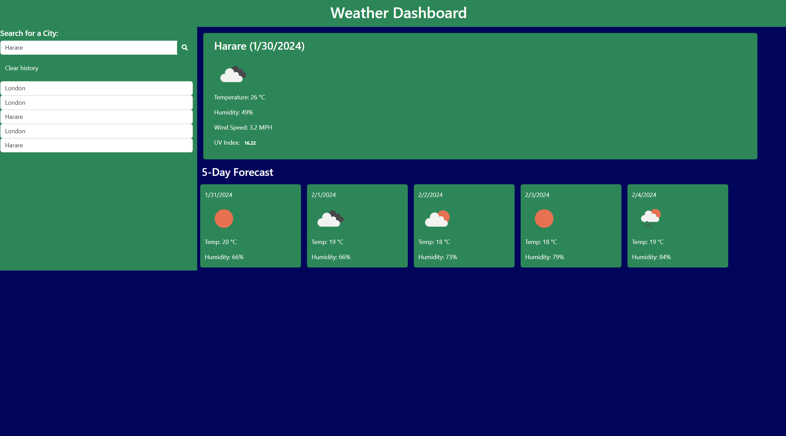
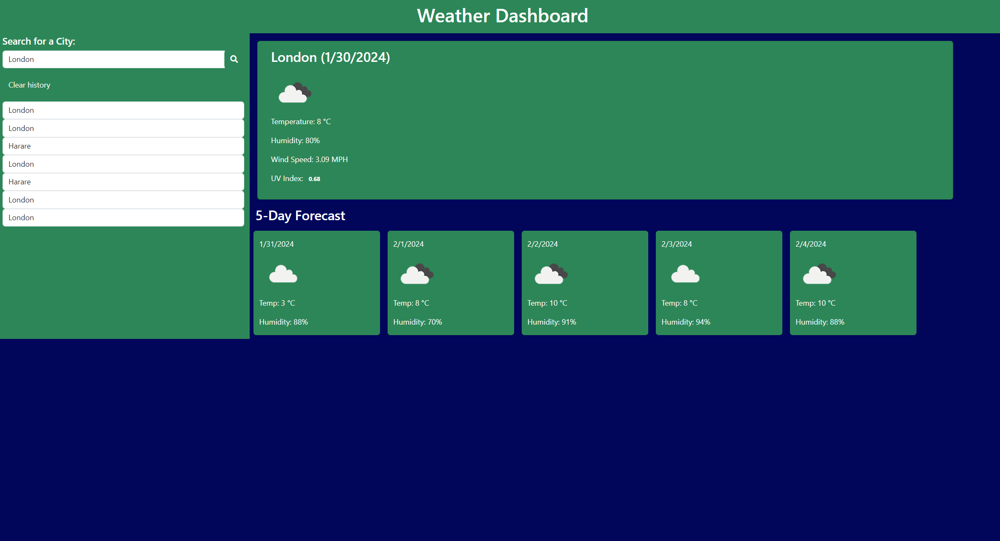
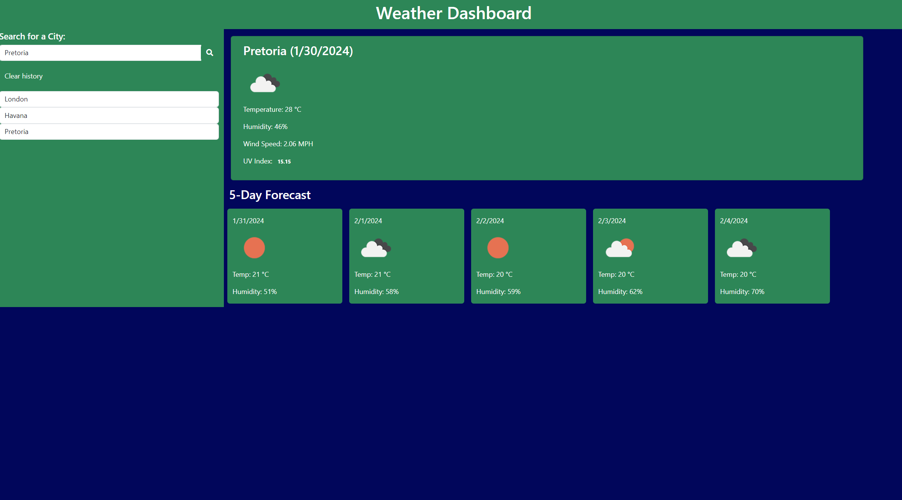
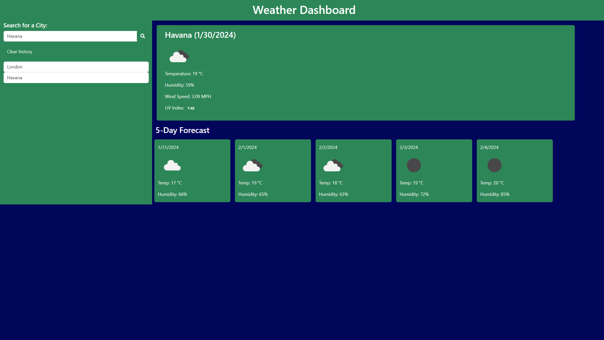

# Weather-dashboard

## Description 
This web application retrieves city weather data from Open Weather and displays wind speed, temperature, humidity and UV index. The weather data for the searched city is for the current day and then weather data for the next five days.

The user will type the name of a city they want to get weather data for and the web application will return the results as shown in the screenshots for Harare, London, Paris and Havana. 

The web application has been designed using HTML, CSS, JavaScript, Bootstrap, JQuery and Google Fonts and Day.js. 

I built a weather dashboard that will run in the browser and feature dynamically updated HTML and CSS. I used the 5-Day Weather Forecast API and linked my application to this external site and retrieved weather data for cities.
The weather application meets the following criteria:
(1) When a user searches for a city they are presented with current and future conditions for that city and that city is added to the search history.

(2) When a user views the current weather conditions for that city they are presented with:
(a) The city name
(b) The date
(c) An icon representation of weather conditions
(d) The temperature
(e) The humidity
(f) The wind speed

## Table of Contents (Optional)
N/A

## Installation

The web application does not require any installation and will run on most internet browsers. The web application is deployed at this link here and feel free to click and experience its magical works: https://mikemupararano.github.io/weather-dashboard/. The Github repository is on this link: https://github.com/Mikemupararano/weather-dashboard.

## Usage 
To have an idea of what is in this web application, please click on this link: https://mikemupararano.github.io/weather-dashboard/. The Github repository is on this link: https://github.com/Mikemupararano/weather-dashboard.

## Credits
I researched website and watched several videos to adapt and work out the code in this web application. I used the following web-links for research and support:
(1) https://openweathermap.org/weather-dashboard
(2) https://www.youtube.com/watch?v=6gBfgoaJImE
(3) https://www.youtube.com/watch?v=w0VEOghdMpQ
(4) https://www.youtube.com/watch?v=14fkn_SA-AY
(5) https://www.youtube.com/watch?v=buS3mweBWCA
(6) https://www.visualcrossing.com/resources/documentation/weather-api/how-to-load-weather-data-in-javascript/
(7) https://www.shecodes.io/athena/4137-using-the-javascript-fetch-api-for-weather-forecasts
(8) https://github.com/jscottrumptz/06-weather-dashboard

## License

See the repository for any information on the MIT license.
🏆 

## Badges
N/A
## Features

N/A
## Contributing

Any other contributors are welcome to contact me and add to my code or suggest improvements. Click on this link to contribute on improvements: https://github.com/Mikemupararano/weather-dashboard.

## Tests
N/A
© 2023 edX Boot Camps LLC. Confidential and Proprietary. All Rights Reserved.

